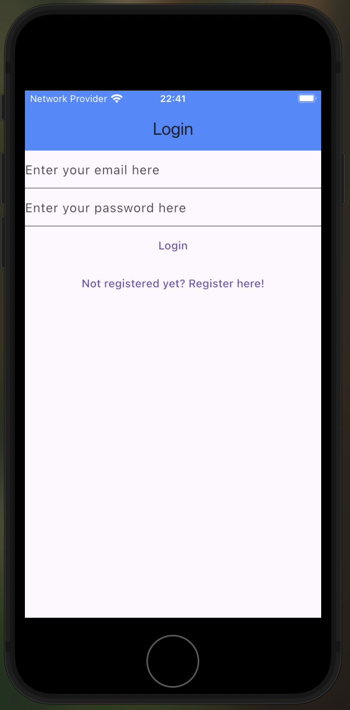
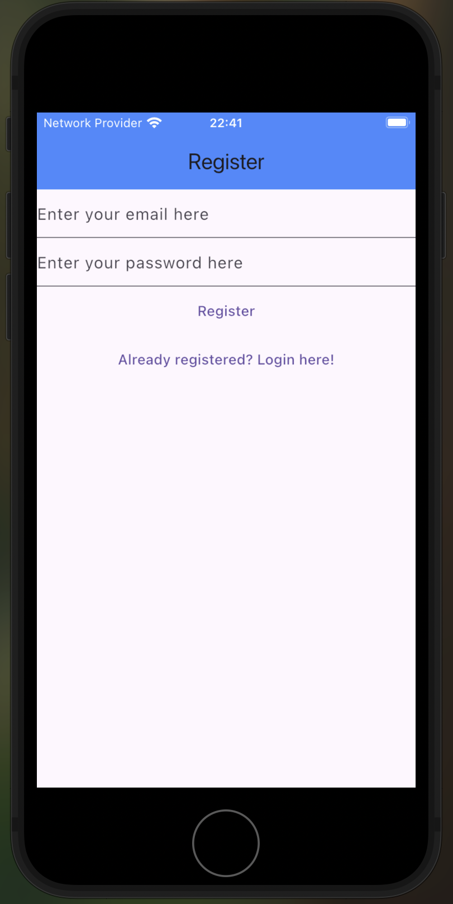
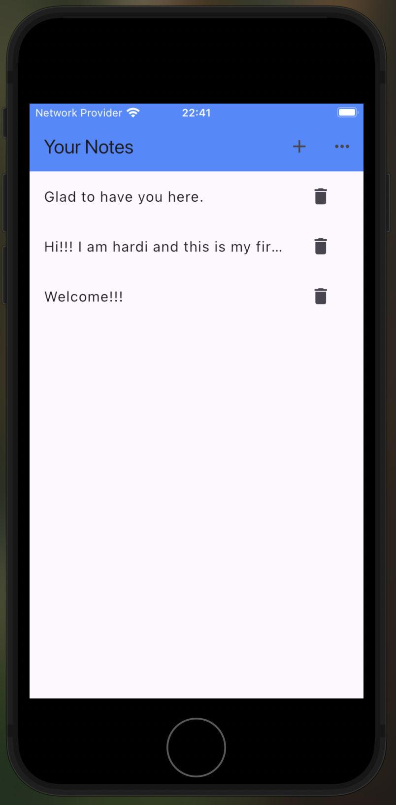
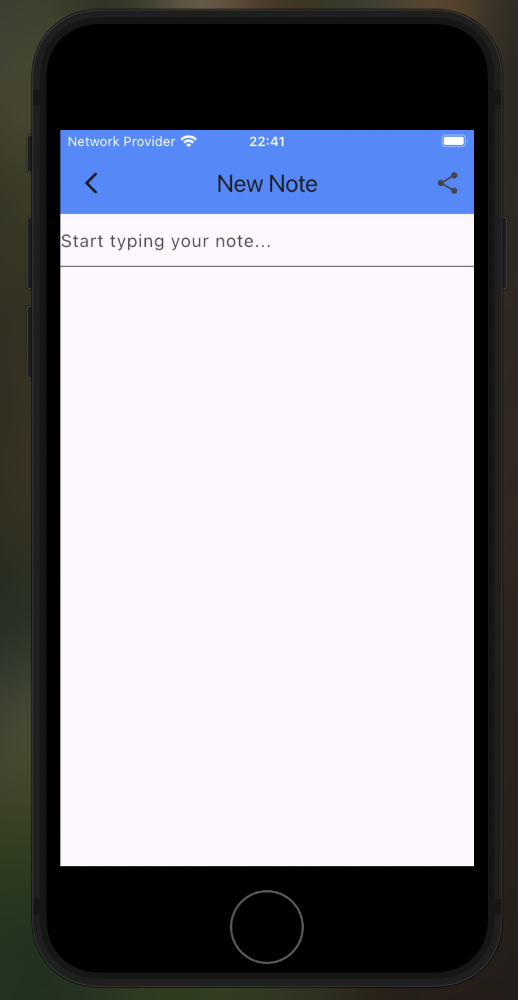
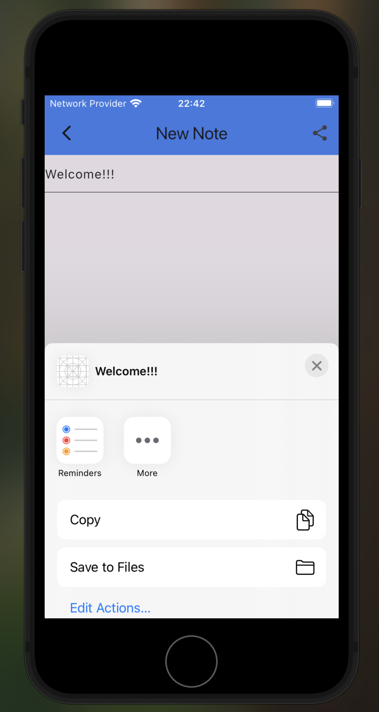

# 📝 Multiuser Notes App (Flutter + Firebase + SQLite)

A powerful **cross-platform** notes application built with **Flutter**, supporting multiple users with secure login, note management, and sharing functionality. This project is designed using the **MVC architecture**, separating UI, logic, and data layers for scalability and clean code maintenance.

## 🚀 Features

- 🔐 **User Authentication** using **Firebase Auth**
- 👥 **Multiuser Support** – each user accesses their own session
- 🧠 **Create, Read, Update, Delete Notes (CRUD)** securely by doing API calls to firebase per user
- 💾 Local data persistence using **SQLite**
- 📤 **Share notes** via email, WhatsApp, and other platforms
- 📱 Works on both **Android and iOS**
- 🧩 Modular MVC-based code structure
- ✨ Clean and responsive UI with Flutter

## 🛠️ Tech Stack

- **Flutter** – for frontend UI and app logic
- **Firebase Authentication** – for secure user login and session handling
- **SQLite** – for offline storage and local note management
- **Platform Channels / Sharing Plugins** – to enable sharing notes through other apps

## 📸 Screenshots

  
  
  

  
  

## 🔧 Setup Instructions

1. Clone the repository
2. Run `flutter pub get`
3. Connect your Firebase project and add `google-services.json` (Android) and/or `GoogleService-Info.plist` (iOS)
4. Build and run the app on your emulator or device

 
 ## 📬 Contact Me

- [GitHub](https://github.com/hardivaidya004506)
- [LinkedIn](https://www.linkedin.com/in/hardi-jignesh-vaidya-118605340/)

---

> 🌟 Feel free to fork this repo, explore the code, or reach out if you'd like to collaborate on cool projects!

## 🤝 Contributions

Pull requests and suggestions are welcome! Feel free to fork the repository and improve it.

--
